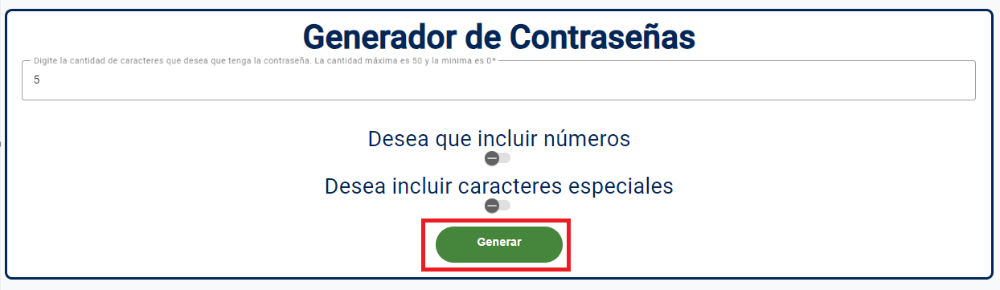
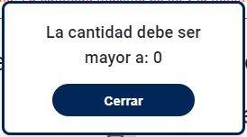

# Introducción:
Esta aplicacion web se encarga de generar contraseñas aleatorias con base a las opciones que el usuario
desee habilitar como la longitud, carateres numericos y especiales para la contraseña.

# Instalación:
Para poder ejecutar esta aplicacion es necesario isntalar:
- Node.js v18.
- Angular CLI: 16.
- Visual Studio code.
Asi como tambien instalar la extencion Angular Language Service v16.1.8.
y las siguientes liberias:
- ClipboardModule(npm install ngx-clipboard).
- Angular Material(ng add @angular/material).
- Bootstrap(npm install bootstrap).

# Verisones del proyecto
"@angular/animations": "^16.1.0",
    "@angular/cdk": "^16.2.8",
    "@angular/common": "^16.1.0",
    "@angular/compiler": "^16.1.0",
    "@angular/core": "^16.1.0",
    "@angular/forms": "^16.1.0",
    "@angular/material": "^16.2.8",
    "@angular/platform-browser": "^16.1.0",
    "@angular/platform-browser-dynamic": "^16.1.0",
    "@angular/router": "^16.1.0",
    "@popperjs/core": "^2.11.8",
    "bootstrap": "^5.3.2",
    "jquery": "^3.7.1",
    "ngx-clipboard": "^16.0.0",
    "rxjs": "~7.8.0",
    "tslib": "^2.3.0",
    "zone.js": "~0.13.0"

# Ejecución local:
Para ejecutar localmente la aplicacion, es necesario abrir el proyecto en visual studio y en una terminal ejecutar el comando "ng s".

# Manual de la aplicacion:
Una vez que ejecutamos la aplicacion localmente, el navegador nos mostrara la siguiente ventana:
.

En esta ventana podemos definir la cantidad de carateres, si desamos que la contraseña lleve numeros y
si deseamos que la contraseña lleve caracteres especiales como: !,@,(,) entre otros.

- Agregando la cantidad o longitud de caracteres:
Como se muestra en la imagen, en el campo con la leyenda "Digite la cantidad de caracteres que desea   que tenga la contraseña", podemos digitar la cantidad de caracteres que queremos que se generen en la    contraseña. En este caso voy a colocar una contraseña con la cantidad de 5 caracteres, ver imagen a continuacion:
.

Una vez que se digite correctamente la cantidad de caracteres el sistema nos habilitara el boton de generer como se muestra en la siguiente imagen:
.

- Validaciones de la cantidad de caracteres:
Este campo contiene valicaciones las cuales se van a detallar a continuacion:
1- Si no se digita un numero el campo se pondra en rojo y no habilitara el boton de generar. El boton se mostrara en color girs hasta que cumpla con los requisitos, ver imagen a continuacion.
:
2- El primer numero debe de ser mayor a 0. En caso de que coloquemos un 0 de entrada el sistema nos mostrara el siguiente mensaje:
.
3- El sistema no permitira que se coloquen los siguientes caracteres: "+, -, . y e". Si se colocan nos mostrara el siguiente mensaje:

- Escogiendo numeros en la contraseña:
Si deseamos que la contraseña contenga numeros, debemos de dar un click al switch y debera de quedar de la siguiente forma:
.
Una vez seleccionado el sistema nos mostrara el siguiente mensaje:
.

Si "NO" deseamos que la contraseña contenga numeros, el switch debera de quedar de la siguiente forma:
.
Una vez seleccionado el sistema nos mostrara el siguiente mensaje:
.

- Escogiendo caracteres especiales en la contraseña:
Si deseamos que la contraseña contenga caracteres especiales, debemos de dar un click al switch y debera de quedar de la siguiente forma:

Una vez seleccionado el sistema nos mostrara el siguiente mensaje:

Si "NO" deseamos que la contraseña contenga caracteres especiales, el switch debera de quedar de la siguiente forma:

Una vez seleccionado el sistema nos mostrara el siguiente mensaje:

-Generando la contraseña:
Una vez que escogemos las opciones que deseamos y la longitud de la contraseña, procedemos con resional el boton de "Generar" , para que el sistema nos genere la contraseña y nos mostrara la contraseña en el siguiente mensaje:
.

Si queremos copiar la contraseña, podemos presionar el siguiente icono con la leyenda "Copiar contraseña" como se muestra en la siguiente imagen:
.

Nota: la contraseña se guardara en el portapapeles por lo que si desea puede copiarla o guardarla en su lugar de preferencia.

Una vez que el sistema copiara la contraseña, el sistema mostrara en la parte superior de la pantalla el siguiente mensaje: 
.
Este mensaje se cerrara automaticamente en 2 segundos o bien puede presionar cerrar.

# GenerarContrasenas

This project was generated with [Angular CLI](https://github.com/angular/angular-cli) version 16.1.2.

## Development server

Run `ng serve` for a dev server. Navigate to `http://localhost:4200/`. The application will automatically reload if you change any of the source files.

## Code scaffolding

Run `ng generate component component-name` to generate a new component. You can also use `ng generate directive|pipe|service|class|guard|interface|enum|module`.

## Build

Run `ng build` to build the project. The build artifacts will be stored in the `dist/` directory.

## Running unit tests

Run `ng test` to execute the unit tests via [Karma](https://karma-runner.github.io).

## Running end-to-end tests

Run `ng e2e` to execute the end-to-end tests via a platform of your choice. To use this command, you need to first add a package that implements end-to-end testing capabilities.

## Further help

To get more help on the Angular CLI use `ng help` or go check out the [Angular CLI Overview and Command Reference](https://angular.io/cli) page.
