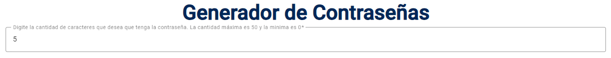

# Introducción:
Está aplicación web esta desarrollada con el lenguaje de Angular y  se encarga de generar contraseñas aleatorias con base a las opciones que el usuario desee habilitar como la longitud, caracteres numéricos y especiales para la contraseña.

# Instalación:
Para poder ejecutar esta aplicación localmente es necesario instalar:
- Node.js v18.
- Angular CLI: 16.
- Visual Studio code.

Así como también instalar la extensión Angular Language Service v16.1.8 una vez que se instale el visual studio code. Esta extension la podemos descargar en la parte de extenciones y la buscamos en el buscador del visual studio code.
 
Las siguientes librerías se utilizaron para crear la aplicacion:
- ClipboardModule(npm install ngx-clipboard).
- Angular Material(ng add @angular/material).
- Bootstrap(npm install bootstrap).

# Verisones del proyecto
"@angular/animations": "^16.1.0",
    "@angular/cdk": "^16.2.8",
    "@angular/common": "^16.1.0",
    "@angular/compiler": "^16.1.0",
    "@angular/core": "^16.1.0",
    "@angular/forms": "^16.1.0",
    "@angular/material": "^16.2.8",
    "@angular/platform-browser": "^16.1.0",
    "@angular/platform-browser-dynamic": "^16.1.0",
    "@angular/router": "^16.1.0",
    "@popperjs/core": "^2.11.8",
    "bootstrap": "^5.3.2",
    "jquery": "^3.7.1",
    "ngx-clipboard": "^16.0.0",
    "rxjs": "~7.8.0",
    "tslib": "^2.3.0",
    "zone.js": "~0.13.0"

# Ejecución local:
Para ejecutar localmente la aplicación, es necesario abrir el proyecto en visual studio code. Cuando el proyecto este abierto en visual studio code, en una terminal ejecutamos el comando "npm install". Luego, para abrir una ventana del navegador, en la misma terminal colocamos el codigo "ng s". Con esto el sistema nos indicará en qué local host está el proyecto disponible, como por ejemplo "http://localhost:4200/".

# Manual de la aplicacion:
Una vez que ejecutamos la aplicación localmente, el navegador nos mostrara la siguiente ventana:
.

En esta ventana podemos definir la cantidad de caracteres, si deseamos que la contraseña lleve números y
si deseamos que la contraseña lleve caracteres especiales como: !,@,(,) entre otros.

Importante tener en cuenta que las opciones de caracteres especiales y números, el sistema los tomara en cuenta para generar la contraseña al azar. Esto significa que cabe la posibilidad de que la contraseña, aunque marquemos esta opción, no contenga estos caracteres o números porque se generan aleatoriamente. 

- Agregando la cantidad o longitud de caracteres:
Como se muestra en la imagen, en el campo con la leyenda "Digite la cantidad de caracteres que desea   que tenga la contraseña", podemos digitar la cantidad de caracteres que queremos que se generen en la contraseña. En este caso voy a colocar una contraseña con la cantidad de 5 caracteres, ver imagen a continuación:
.

Una vez que se digite correctamente la cantidad de caracteres, el sistema nos habilitara el botón de generar como se muestra en la siguiente imagen:
.

- Validaciones de la cantidad de caracteres:
Este campo contiene validaciones las cuales se van a detallar a continuación:
1- Si no se digita un número, el campo se pondrá en rojo y no habilitará el botón de generar. El botón se mostrará en color gris hasta que cumpla con los requisitos, ver imagen a continuación.
:
2- El primer número debe de ser mayor a 0. En caso de que coloquemos un 0 de entrada, el sistema nos mostrara el siguiente mensaje:
.
3- El sistema no permitirá que se coloquen los siguientes caracteres: "+, -, . y e". Si se colocan nos mostrará el siguiente mensaje:
.

- Escogiendo números en la contraseña:
El sistema está configurado para que por defecto la contraseña no contenga números, por lo que nos mostrara el switch de la forma siguiente forma:
. Si al momento de querer generar una contraseña no cambiamos o interactuamos con este switch y presionamos el botón "Generar", el sistema procederá a generar la contraseña sin la posibilidad de que los números sean tomados en cuenta.

Si deseamos que la contraseña contenga números, debemos de dar un clic al switch y deberá de quedar de la siguiente forma:
.
Una vez seleccionado el sistema nos mostrará el siguiente mensaje:
.

Si cambiamos de parecer y "NO" deseamos que la contraseña contenga números después de haber interactuado con el switch, debemos de cambiar el switch y dejarlo de la siguiente forma:
.
Una vez seleccionado el sistema nos mostrará el siguiente mensaje:
.

- Escogiendo caracteres especiales en la contraseña:
El sistema está configurado para que por defecto la contraseña no contenga caracteres especiales, por lo que nos mostrara el switch de la forma siguiente forma:
. Si al momento de querer generar una contraseña no cambiamos o interactuamos con este switch y presionamos el botón "Generar", el sistema procederá a generar la contraseña sin la posibilidad de que los caracteres especiales sean tomados en cuenta.

Si deseamos que la contraseña contenga caracteres especiales, debemos de dar un clic al switch y deberá de quedar de la siguiente forma:

Una vez seleccionado el sistema nos mostrará el siguiente mensaje:

Si cambiamos de parecer y "NO" deseamos que la contraseña contenga caracteres especiales después de haber interactuado con el switch, debemos de cambiar el switch y dejarlo de la siguiente forma:

Una vez seleccionado el sistema nos mostrará el siguiente mensaje:

-Generando la contraseña:
Una vez que escogemos las opciones que deseamos y la longitud de la contraseña, procedemos con presionar el botón de "Generar" , para que el sistema nos genere la contraseña y nos mostrara la contraseña en el siguiente mensaje:
.

La contraseña generada es la que esta en el cuadro en rojo de la siguiente imagen:

Si al momento de escoger una cantidad de caracteres muy grande, el sistema habilitara una barra para qué podemos ver por completo la contraseña generada como aparece en la siguiente imagen:
.

Si queremos copiar la contraseña, podemos presionar el siguiente icono marcado en rojo de la siguiente imagen:

Como ayuda visual, al momento de posesionarnos sobre el icono de copiar, el sistema nos mostrara la leyenda "Copiar contraseña" como se muestra en la siguiente imagen:
.

Nota: la contraseña se guardará en el portapapeles, por lo que si desea puede copiarla o guardarla en su lugar de preferencia.

Una vez que el sistema copie la contraseña, el sistema mostrara en la parte superior de la pantalla el siguiente mensaje: 
.
Este mensaje se cerrará automáticamente en 2 segundos o bien puede presionar cerrar.

- Mensaje de error en caso de fallo:
En caso de que la aplicación tenga problemas con el consumo de la API o de conexión, el sistema nos mostrara el siguiente mensaje:

Adicionalmente, en la consola del navegador aparecerán los errores reportados.

- Cerrar mensajes:
En cada mensaje que se muestra en la aplicación, aparecerá un botón como el que se muestra a continuación, el cual nos permite cerrar el mensaje.
.

